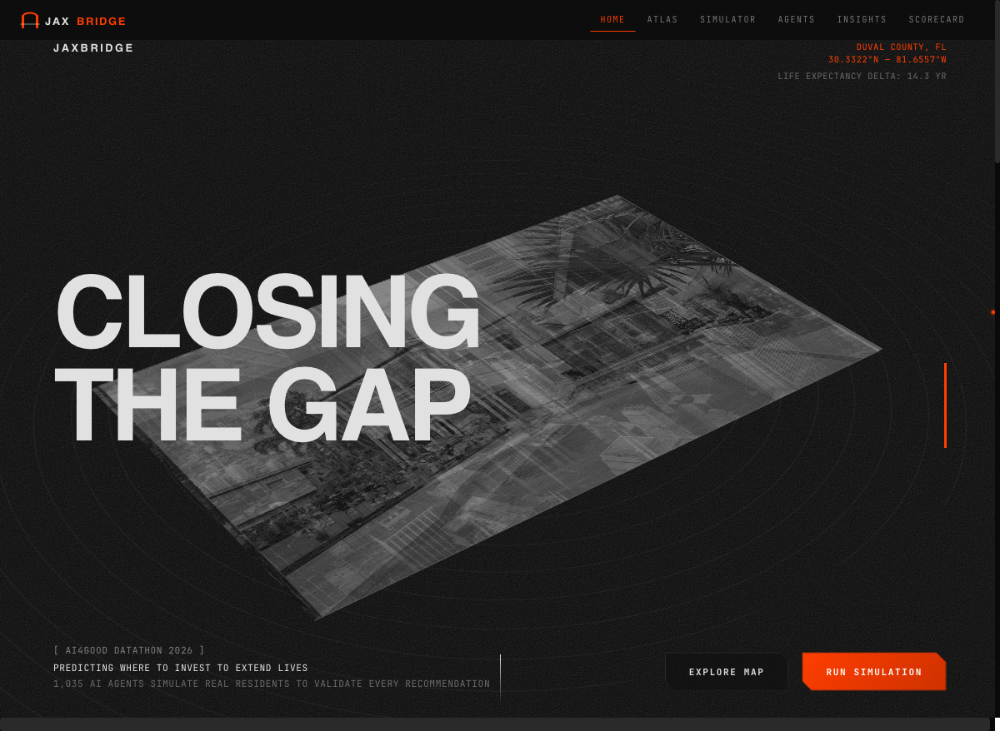
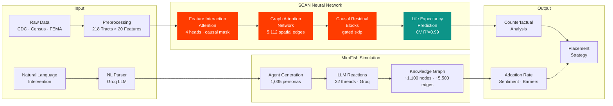
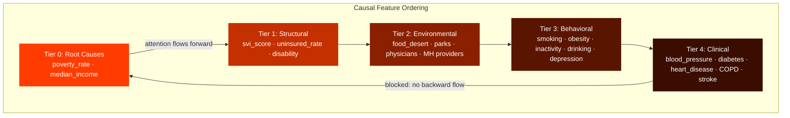
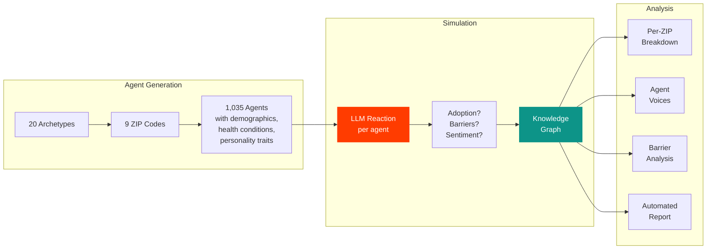
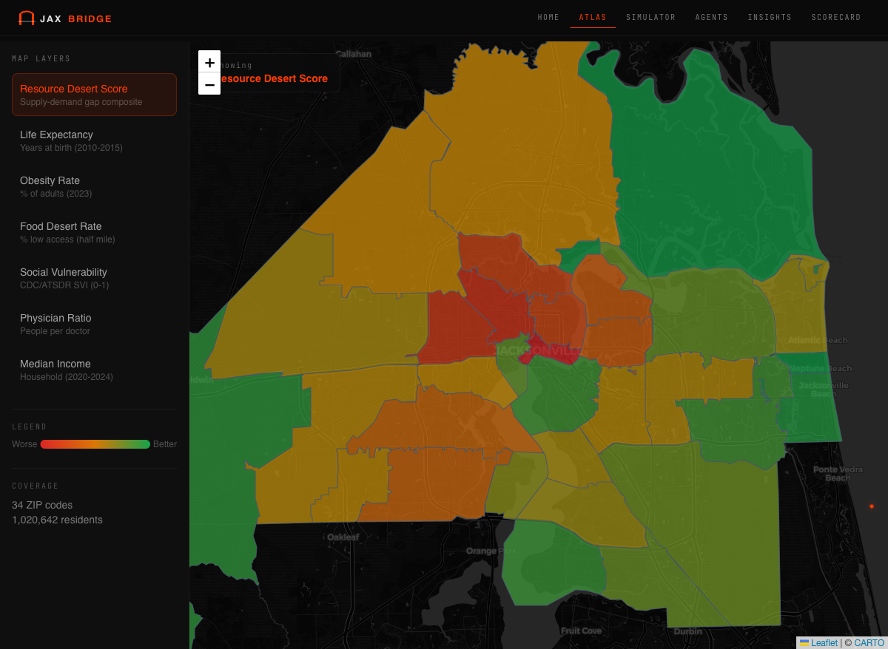
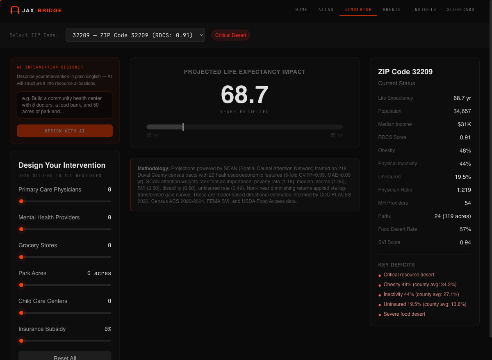
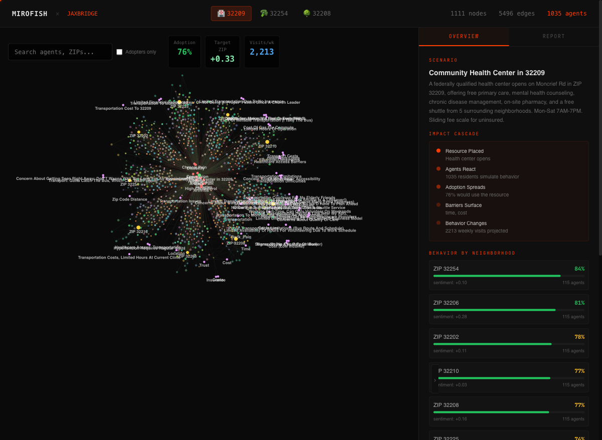
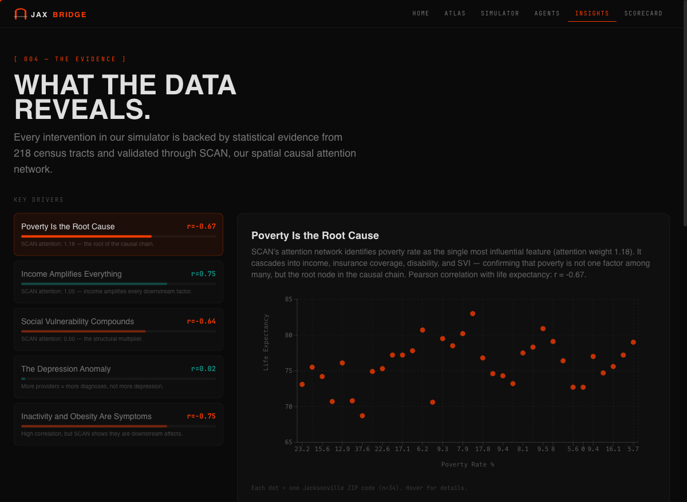
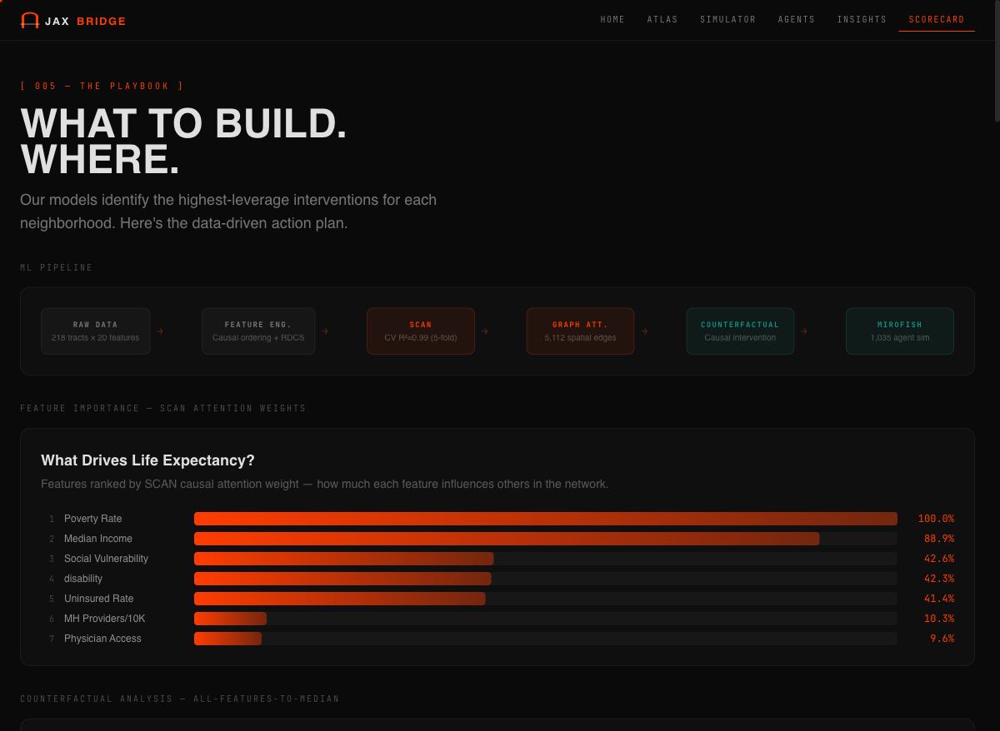
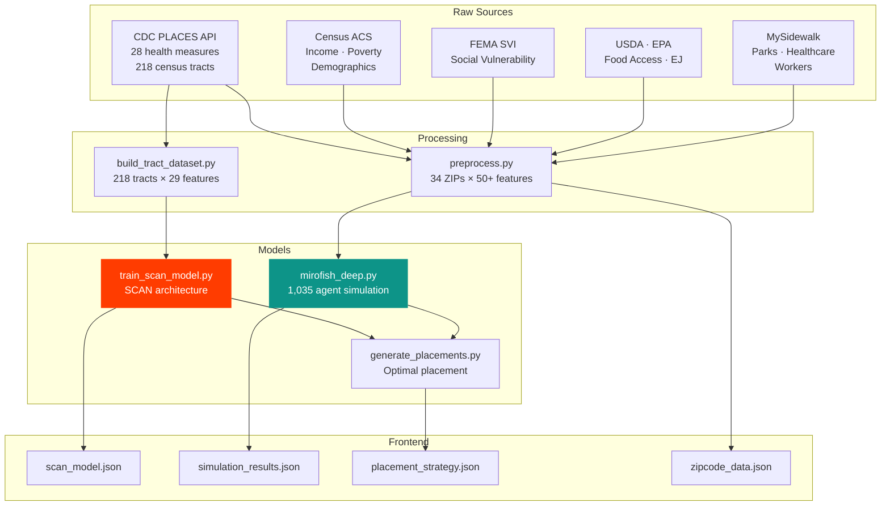

<div align="center">

# JaxBridge

**Health equity decision engine for Jacksonville, FL**

[](https://react.dev)
[](https://typescriptlang.org)
[](https://pytorch.org)
[](https://vite.dev)
[](LICENSE)

[Architecture](#scan-spatial-causal-attention-network) · [Agent Simulation](#mirofish-agent-simulation) · [Screenshots](#screenshots) · [Setup](#getting-started)

---



</div>

In Jacksonville, a **14-year life expectancy gap** separates neighborhoods 20 miles apart. ZIP 32209: 68.7 years. ZIP 32266: 83.0 years. Same city, completely different outcomes.

JaxBridge identifies what drives this gap, lets users design interventions in plain English, simulates how 1,035 residents would react, and recommends exactly where to invest.

## System Architecture



## SCAN: Spatial Causal Attention Network

A novel PyTorch architecture for health equity prediction. Most models treat each geographic unit independently — SCAN models how neighborhoods influence each other.



**Key innovations:**

| Component | What It Does | Why It Matters |
|-----------|-------------|----------------|
| Feature Interaction Attention | 4-head self-attention with causal masking | Discovers compounding health factors while enforcing epidemiological direction |
| Graph Attention Network | 5,112 distance-weighted edges across 218 tracts | Models spatial spillover — a clinic in 32209 benefits adjacent 32254 |
| Causal Residual Blocks | Gated skip connections | Separates baseline health trajectory from intervention effect |
| Physics-Informed Loss | MSE + monotonicity + smoothness | Prevents learning that more obesity → longer life |

**Performance:**

| Metric | Value |
|--------|-------|
| 5-Fold CV R² | **0.99** |
| MAE | **0.09 years** |
| Training samples | 218 census tracts (CDC PLACES 2023) |
| Features | 20 (health, economic, environmental) |
| Spatial edges | 5,112 |
| Parameters | 33,050 |

## MiroFish Agent Simulation

Inspired by [MiroFish](https://github.com/666ghj/MiroFish). 1,035 AI agents simulate how Jacksonville residents would actually react to proposed interventions.



Each agent has: role, age, income, health conditions, transportation mode, insurance status, and personality traits (openness, trust, health concern). Personas are enriched with real community data from r/jacksonville.

## Screenshots

<details>
<summary><strong>Atlas — Interactive Choropleth Map</strong></summary>



34 ZIP code polygons with 7 switchable data layers: Resource Desert Score, Life Expectancy, Obesity, Food Desert Rate, Social Vulnerability, Physician Ratio, Median Income.

</details>

<details>
<summary><strong>Simulator — NL Intervention Designer</strong></summary>



Type an intervention in plain English. AI structures it into resource allocations, auto-adjusts sliders, and projects life expectancy impact via SCAN. Export directly to MiroFish agent simulation.

</details>

<details>
<summary><strong>Agents — MiroFish Knowledge Graph</strong></summary>



Force-directed graph of 1,035 agent nodes with ~5,500 edges. Filter by type, search agents, toggle adopters. Per-ZIP adoption breakdown, impact cascade, agent voice quotes, and automated analysis report.

</details>

<details>
<summary><strong>Insights — Statistical Evidence</strong></summary>



Key drivers ranked by SCAN attention weights (not just correlation). Interactive scatter plots, 10x10 correlation matrix, SCAN architecture diagram, causal interaction map, and AI verification audit.

</details>

<details>
<summary><strong>Scorecard — Investment Playbook</strong></summary>



ML pipeline visualization, SCAN feature importance, counterfactual analysis (+3.8 to +5.3 yr/ZIP), network-optimized placement strategy with satellite topology, per-placement MiroFish simulations, and neighborhood archetypes.

</details>

## Data Pipeline



## Project Structure

```
jaxbridge/
├── app/                          React frontend
│   ├── src/
│   │   ├── pages/                6 pages: Landing, Atlas, Simulator, AgentGraph, Correlations, Scorecard
│   │   ├── components/           Nav, ZipDetailPanel, LoadingSkeleton, ui/
│   │   ├── lib/                  scoring.ts, nlInterventionParser.ts, useReveal.ts
│   │   └── data/                 useZipData.ts
│   └── public/
│       ├── data/                 Pre-computed JSON outputs
│       ├── geo/                  Duval County ZIP GeoJSON
│       └── images/               AI-generated mockup renders
├── pipeline/                     Python ML & data pipeline
│   ├── preprocess.py             Raw CSV → JSON
│   ├── build_tract_dataset.py    CDC PLACES API → 218-tract dataset
│   ├── train_scan_model.py       SCAN architecture + training
│   ├── mirofish_deep.py          1,035-agent simulation
│   ├── generate_placements.py    Network-optimized placement
│   ├── api_server.py             Flask API for live simulation
│   └── scrape_community_voices.py  Reddit data enrichment
├── data/Datasets/                Raw source CSVs
└── docs/                         Screenshots
```

## Getting Started

### Frontend

```bash
cd app
cp .env.example .env    # add Groq API key for NL features
npm install
npm run dev             # http://localhost:5175
```

Works standalone with pre-computed data. No Python or API keys needed for browsing.

### ML Pipeline (optional)

```bash
python3.11 -m venv .venv && source .venv/bin/activate
pip install torch numpy scikit-learn openai python-dotenv flask flask-cors zep-cloud shapely

python pipeline/preprocess.py            # Process raw CSVs
python pipeline/build_tract_dataset.py   # Pull 218 tracts from CDC API
python pipeline/train_scan_model.py      # Train SCAN
python pipeline/mirofish_deep.py         # Run 1,035-agent simulation
python pipeline/generate_placements.py   # Compute optimal placements
```

### Live Simulation API

```bash
python pipeline/api_server.py   # http://localhost:5001
```

## Tech Stack

| Layer | Technology |
|-------|-----------|
| Frontend | React 18, TypeScript, Vite 8, Tailwind CSS 4 |
| Visualization | Leaflet, react-force-graph-2d, Recharts |
| Animation | Lenis smooth scroll, CSS keyframes, IntersectionObserver |
| Neural Network | PyTorch (SCAN) |
| Agent Simulation | Groq LLM API, MiroFish pipeline, Zep Cloud |
| API | Flask |
| Data | CDC PLACES, Census ACS, FEMA SVI, USDA, EPA |

## License

MIT

<div align="center">
<sub>AI4Good Datathon 2026</sub>
</div>
